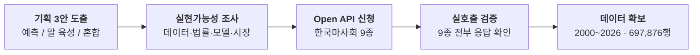

# 이건모 — 주간 작업 정리 (2026-08-24 ~ 08-28)

**주제:** 경마 데이터 기반 예측 플랫폼 (SSAFY 블록체인 프로젝트 — 스마트 컨트랙트 기반 예측 시스템)

# 이번 주 한 일

> 사전 조사 노션: https://app.notion.com/p/3c69b074860a80629aa4f07a24c5c8a0?source=copy_link

---

## 1. 기획 — 3안

| 안 | 내용 | 핵심 |
|---|---|---|
| **1안. 예측** | 과거 경주 데이터로 AI 예측 모델 학습. **평일**엔 과거 경기를 리플레이해 맞히고, **주말**엔 실제 경기를 예측. 사용자가 파라미터를 직관적으로 수정하는 **나만의 커스텀 예측 모델** 제공 | AI·데이터 파이프라인이 본체. 실제 착순이라는 외부 정답이 있어 **정량 성과 측정 가능** |
| **2안. 말 만들기** | 말을 키워서(육성) 내 말을 경주에 참가시키고 베팅 | 게임성·리텐션은 좋으나 자체 시뮬레이터라 **AI 성능을 증명할 방법이 없음** |
| **3안. 1+2** | 말 키워서 베팅(평일) + 과거 정답지 기반 베팅(평일) + 주말 실제 경기 베팅 | 1안을 본체로, 육성을 리텐션 레이어로 얹는 절충 |

**현재 판단:** 1안을 본체로 두고 3안 방향으로 확장. 2안 단독은 AI 증명력이 없어 제외.

---

## 2. 신청한 Open API (한국마사회 / data.go.kr)

개발계정으로 신청 → 자동승인. **9종 실호출 검증 완료 (전부 `resultCode=00`)**

| # | 데이터셋 | 엔드포인트 | 필드 | 용도 |
|---|---|---|---|---|
| 1 | 경주기록 정보 | `API4_3/raceResult_3` | 89 | **★ 학습 원장** (결과+환경+배당) |
| 2 | 출전표 상세정보 | `API26_2/entrySheet_2` | 48 | **★ 개발용** (경기 전 정보+발주시각) |
| 3 | 경주계획표 | `API72_2/racePlan_2` | 21 | 편성·발주 스케줄 |
| 4 | AI학습용_경주결과 | `API155/raceResult` | 27 | 보조 (생년월일) |
| 5 | 마필 구간별 경주기록 | `API37_1/sectionRecord_1` | 29 | 말별 구간 기록 |
| 6 | 확정배당율 통합 | `API160_1/integratedInfo_1` | 8 | 승식 7종 배당률 |
| 7 | 경주마 성적 정보 | `API15_2/raceHorseResult_2` | 31 | 말 통산 전적 |
| 8 | 경주마 레이팅 정보 | `API77/raceHorseRating` | 7 | 현역 레이팅 |
| 9 | 조교사통산전적비교 | `trtresult/gettrtresult` | 10 | 조교사 전적 |

- 이용허락범위 **제한 없음**, 무료, 개발계정 **3,000콜/일**
- **확보 데이터: 2000년 ~ 현재, 697,876행** (말-경주 단위)

---

## 3. 확보한 데이터 형식

### 3-1. 학습에 사용할 데이터 — 결과 포함

`API4_3/raceResult_3` · 총 89열 중 주요 열 · 2026-08-23 서울 1R

| chulNo(게이트) | hrName(마명) | wgHr(마체중) | weather | track(주로) | winOdds(배당) | ord(착순) |
|---|---|---|---|---|---|---|
| 8 | 태평에스지 | 465(+9) | 맑음 | 포화 (16%) | 7.4 | **1** |
| 4 | 라온카리스걸 | 487(+7) | 맑음 | 포화 (16%) | 5.6 | 2 |
| 6 | 루나삭스 | 475(+7) | 맑음 | 포화 (16%) | 1.7 | 3 |
| 5 | 관악산점프 | 470() | 맑음 | 포화 (16%) | 6.9 | 4 |
| 1 | 블랙타임 | 443(+6) | 맑음 | 포화 (16%) | 11.2 | 5 |

이 외 학습에 쓸 열: `wgBudam`(부담중량) `age` `sex` `ilsu`(휴양일수) `rating` `rcDist` `rank`(등급) `jkName`/`trName`(기수·조교사) `rcTime`(주파기록) `diffUnit`(착차) `chaksun1~5`(상금) + **구간기록 30여 열**(S1F·1~4코너·G3F·G1F 통과기록/순위)

> 인기 1위(배당 1.7)가 3착, 7.4배가 우승 — **시장이 완벽하지 않다**는 것을 한 경주가 보여줌. 모델의 목표가 여기서 생김.

### 3-2. 개발에 사용할 데이터 — 경기 전 (예측 입력)

`API26_2/entrySheet_2` · 총 28열 중 주요 열 · 2026-08-28 부산경남 1R

| 발주시각 | chulNo(게이트) | hrName(마명) | ilsu(휴양일) | wgBudam(부담중량) | jkName(기수) |
|---|---|---|---|---|---|
| 12:50 | 1 | 퍼플퀸 | 65 | 52.5 | 서강주 |
| 12:50 | 2 | 미스팰컨 | 65 | 52.5 | 최은경 |
| 12:50 | 3 | 그레이윈드 | 65 | 52.5 | 다실바 |
| 12:50 | 4 | 천년여제 | 65 | 52.5 | 전진구 |
| 12:50 | 5 | 레이스나인 | 65 | 52.5 | 서승운 |

이 외 개발에 쓸 열: `rcDate` `meet`(경마장) `rcNo` `rcDist` `rank` `dusu`(출주두수) `age` `sex` `prd`(산지) `rating` `trName` `owName` `chaksun1~5`

### 3-3. 파생 데이터 — 기수 성적 (원장에서 직접 집계)

| 이름 | 출주수 | 1착 | 승률% | 복승률% | 평균착순 |
|---|---|---|---|---|---|
| 서승운 | 1,514 | 352 | **23.2** | 39.3 | 5.10 |
| 다실바 | 1,518 | 279 | 18.4 | 32.3 | 5.91 |
| 문현진 | 1,732 | 295 | 17.0 | 29.8 | 6.54 |
| 김홍권 | 1,666 | 236 | 14.2 | 26.5 | 7.02 |
| 원유일 | 1,633 | 109 | 6.7 | 16.2 | 7.76 |

기수 승률이 **2.2% ~ 23.2%로 10배** 차이 → 강한 예측 변수.

---

## 4. 검증하며 확인한 것

**데이터 타이밍 (설계에 직결)**

| 시점 | 채워지는 필드 |
|---|---|
| **경기 3일 전** | 게이트·마명·나이·성별·산지·부담중량·휴양일수·기수·조교사·거리·등급·발주시각 |
| **당일** | 마체중 · 날씨 · 주로상태 |
| **경주 후** | 착순 · 주파기록 · 착차 · **확정배당률** · 구간기록 |

- 출마표는 **수요일 공개**, API로는 **D+3까지만** 조회됨 (다음 주말은 0행)
- 게이트(`chulNo`)는 **취소마 발생 시 번호가 당겨짐** → 발주 직전 재조회 필요
- 배당률은 **확정치만** 제공 → 예측 입력이 아니라 **시장 베이스라인**으로 사용

**주의사항 1건 (실측으로 발견)**
통산전적 필드(`rcCntT` 등)는 **오늘 기준 스냅샷**이라 과거 경주에 붙이면 미래 정보가 샘.
같은 말의 `rcCntT`가 2025-01 / 2025-07 / 2026-07 조회에서 **전부 36으로 동일**함을 확인.
→ 통산 성적은 원장에서 **경주일 이전 데이터만으로 직접 집계**하도록 처리함.

---

## 5. 다음 주 계획

1. 경주 종료 → API 반영 지연 실측 (오늘 8/28 금요일 경주 시간대에 측정)
2. 2000~2026년 전량 백필 후 학습 데이터셋 구축
3. 베이스라인 측정 — 인기 1위마 단순 베팅 적중률
4. 경주 단위 랭킹 모델(LightGBM/XGBoost/CatBoost) 학습 및 시장 대비 성능 비교
